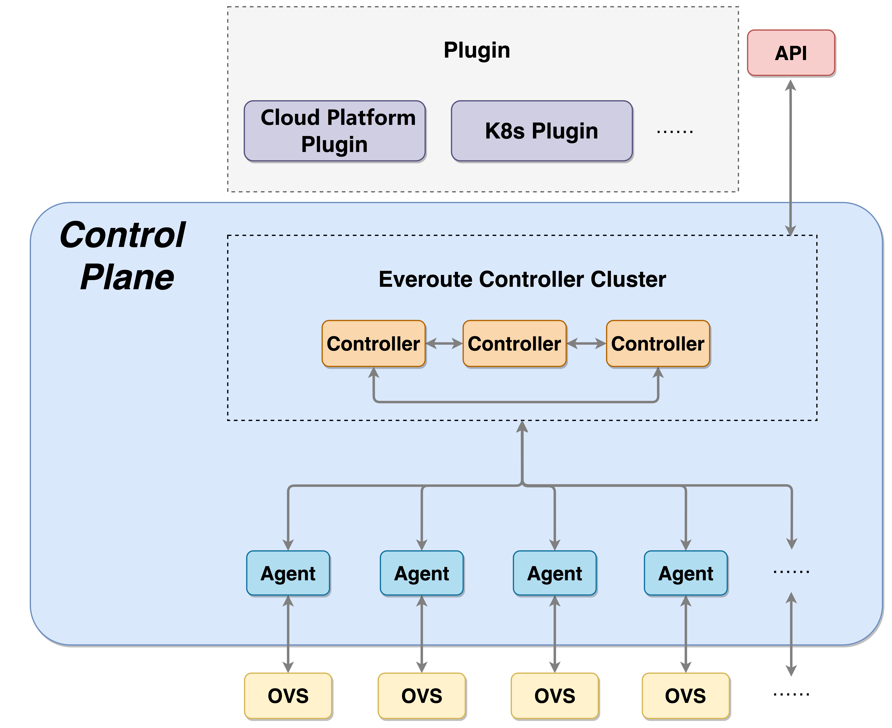

# everoute

## Overview

Everoute is a cloud-native networking and security solution.
It works with OSI Network Model's Layer3/4. It leverages [Open vSwitch](https://www.openvswitch.org)
as the networking data plane.

Everoute provides network and security services for the following platforms:
* Kubernetes cloud-native platform
* Private Cloud
* Public Cloud
* Hybrid Cloud
* Legacy virtualized data center

It can be intergated within these platforms easily.

## Architecture

Everoute takes the SDN (Software Defined Network) methodology as foundation.
It decouples the control plane and data plane, and utilizes software programming
to control the software network and security services.

All the Everoute related services are deployed as Kubernetes Pod, which makes
these services easy to be deployed and managed.

Everoute contains four main parts:

* **Everoute Central Controller**: The Everoute central controller consists of
control service, API Server and etcd, it leverages the cloud-native
architecture, so all the services are deployed as containers. The Everoute
Central Controller provides the controller cluster management and data persistence
based on the [Kube API Server](https://github.com/kubernetes/apiserver)
and [etcd](https://etcd.io). Everoute supports controllers' high availability
and scalability through cluster.
The main task of control service is to manage network and security policies.
It generates network transimit policy rules according to resource types,
security policies and discovered IP addresses.

* **Everoute Distributed Agent**: The Everoute Agent is deployed in each
K8s worker node or hypervisor host, it focuses on the local node policy management.
The Everoute Agent is mainly responsible for discovering endpoint IP address and
watching policy rules from Central controller.

* **Everoute Datapath**: Everoute utilizes the Open vSwitch as it's network
data plane, Everoute leverages it to implement virtual network forwarding, Pod
networking and security features. Everoute uses Open vSwitch openflow mode to
control the network forwarding and security rules.

* **3rd party plugins**: Everoute provides a plugin framework to integrate
within 3rd party platforms, such as [SmartX](https://www.smartx.com/global) -
[SMTX OS](https://www.smartx.com/global/smtx-os) virtualization platform or other
cloud platform.

## Main functions

In the current phase, Everoute support native Kubernetes platform and
SmartX virtualization platform [SMTX OS](https://www.smartx.com/global/smtx-os).

* **Kubernetes Platform**: For the Kubernetes platform, Everoute provides
the native K8s CNI network plug-in. The Everoute CNI supports Pod connection
management, Network Policies, cluster service and NodePort etc. Details please
refer to [Everoute CNI](https://github.com/everoute/everoute/blob/main/docs/cni/README.md) 

* **Virtualization Platform**: [SMTX OS](https://www.smartx.com/global/smtx-os)
is [SmartX](https://www.smartx.com/global) native virtualization platform.
Everoute can be intergated with SMTX OS through the
[CloudTower](https://www.smartx.com/global/cloud-tower) plugin to provide the
Micro-Segmentation service.

## Roadmap

The following features are considered for the near future:
* Network Visibility: to support the network visibility, service map, traffic
monitor etc.
* Overlay support: to support the VXLAN tunnel.
* L3 routing: distributed virtual routing.
* Kubernetes networking enhancement: endPort, ingress LoadBalancer, cluster
service enhancement etc.
* Some function enhancement and performance improvement of the control plane
and data plane.
* Service Function Chain: to support integrated with 3rd party services such
as AV, IPS, IDS, traffic monitor etc.

## License

Everoute is licensed under the [Apache License, version 2.0](LICENSE)